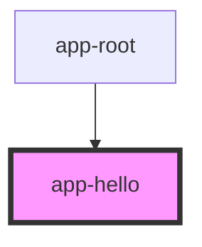

# my-component

<!-- Auto Generated Below -->

## Events

| Event   | Description | Type                                |
| ------- | ----------- | ----------------------------------- |
| `hello` |             | `CustomEvent<{ message: string; }>` |

## Dependencies

### Used by

 - [app-root](../app-root)

### Graph

----------------------------------------------

*Built with [StencilJS](https://stenciljs.com/)*
